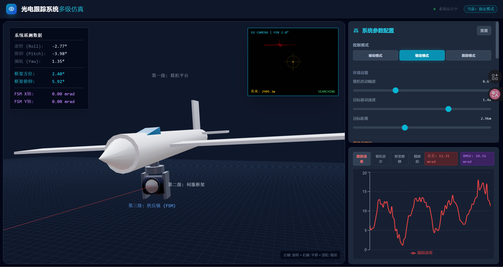

# 🛩️ AeroOptic Tracker Simulator

<div align="center">

</div>

## 📖 简介

机载光电跟踪系统三维仿真平台，展示载机、框架和快反镜之间的多级耦合动力学。

**AeroOptic Tracker Simulator** 是一个基于 React + Three.js 的实时3D仿真系统，用于模拟和可视化机载光电跟踪系统的多级联合控制过程。

## ✨ 特性

- 🎯 **三级联合控制**：载机平台 → 伺服框架 → 快反镜 (FSM)
- 🎮 **实时3D可视化**：基于 React Three Fiber 的高性能渲染
- 📊 **性能监控**：实时误差分析和历史数据图表
- 🔧 **参数可调**：支持多种控制模式和参数调节
- 🎨 **现代UI**：使用 TailwindCSS 构建的响应式界面

## 🚀 快速开始

### 前置要求

- Node.js (v16+)
- npm 或 yarn

### 安装与运行

1. **克隆仓库**
   ```bash
   git clone https://github.com/Awilonk/aerooptic-tracker-sim.git
   cd aerooptic-tracker-sim
   ```

2. **安装依赖**
   ```bash
   npm install
   ```

3. **启动开发服务器**
   ```bash
   npm run dev
   ```

4. **访问应用**
   
   打开浏览器访问 `http://localhost:3000`

## 🎮 使用说明

### 控制模式

- **PASSIVE（被动模式）**：仅载机干扰，无主动跟踪
- **TRACKING（跟踪模式）**：完整三级联合跟踪控制

### 主要参数

- **目标距离**：500m - 7000m
- **目标速度**：控制目标机动频率
- **载机干扰幅度**：模拟飞行姿态变化
- **框架增益**：伺服系统响应速度
- **FSM增益**：快反镜精细调整能力

## 🏗️ 技术栈

- **前端框架**：React 19 + TypeScript
- **3D渲染**：Three.js + React Three Fiber
- **UI组件**：TailwindCSS
- **图表库**：Recharts
- **构建工具**：Vite

## 📁 项目结构

```
aerooptic-tracker-sim/
├── components/          # React 组件
│   ├── Scene3D.tsx     # 3D 场景渲染
│   └── Dashboard.tsx   # 控制面板和图表
├── services/           # 服务层
├── types.ts            # TypeScript 类型定义
├── constants.ts        # 常量配置
└── App.tsx            # 主应用入口
```

## 🤝 贡献

欢迎提交 Issue 和 Pull Request！

## 📄 许可证

MIT License

## 👨‍💻 作者

[@Awilonk](https://github.com/Awilonk)
